# Azure function app

Azure Functions is a **serverless computing service** provided by Microsoft Azure that allows developers to build and *deploy event-driven applications* without the need to manage infrastructure. With Azure Functions, developers can focus solely on writing code to handle specific events, leaving the underlying infrastructure and scaling aspects to the Azure platform. This enables faster development, reduced operational costs, and enhanced scalability.

# Key Features of Azure Functions

**Event-driven Computing:** Azure Functions are triggered by various events, such as HTTP requests, timers, messages in queues, file uploads, or changes to data in databases. This event-driven approach allows developers to respond to specific events in real-time without the need to maintain persistent server instances.
**Serverless Architecture: **Azure Functions follows the serverless computing paradigm, meaning there are no servers to provision or manage. The platform automatically handles infrastructure scaling, ensuring resources are allocated based on the actual demand, making it highly cost-efficient.
**Language and Platform Support:** Azure Functions supports multiple programming languages, including **C#, JavaScript, Java, Python, and TypeScript**. This flexibility allows developers to work with their preferred language and leverage existing codebases seamlessly.
**Pay-as-You-Go Pricing:** Azure Functions offer a pay-as-you-go billing model. You only pay for the compute resources used during the execution of your functions. This cost-effective approach ensures you are charged only for the actual usage without any upfront commitments.
**Integration with Azure Services:** Azure Functions seamlessly integrate with various Azure services like Azure Storage, Azure Cosmos DB, Azure Service Bus, Azure Event Grid, and more. This integration allows developers to build sophisticated applications by combining the power of different services.

# Benefits of Using Azure Functions

**Faster Time to Market:** With the ability to focus solely on business logic and event handling, developers can quickly build and deploy applications, reducing development time and accelerating time to market.
**Cost Savings:** As Azure Functions automatically scales based on demand, there’s no need to pay for idle server resources, resulting in cost savings, especially for applications with varying workloads.
**Scalability and Elasticity:** Azure Functions scales automatically to handle a large number of events concurrently. This elasticity ensures that your applications can handle high traffic and sudden spikes without any performance degradation.
**Serverless Management:** Microsoft Azure handles all the server management, including updates, security patches, and scaling, freeing developers from operational overhead and allowing them to focus on code development.
**Event-Driven Architecture:** The event-driven nature of Azure Functions enables the decoupling of application components, making it easier to build scalable and resilient microservices architectures.


## Types of Azure Functions

**HTTP Trigger:** This type of function is triggered by an HTTP request. It can be used to build web APIs and handle HTTP-based interactions.
**Timer Trigger:** A timer trigger executes a function on a predefined schedule or at regular intervals. It is useful for performing tasks such as data synchronization, periodic processing, or generating reports.
**Blob Trigger:** This type of function is triggered when a new or updated blob is added to an Azure Storage container. It enables you to automate processes based on changes in storage blobs.
**Queue Trigger:** A queue trigger is triggered when a message is added to an Azure Storage queue. It provides a way to process messages in a queue-based architecture, allowing you to build event-driven applications.
**Event Grid Trigger:** An event grid trigger is invoked when an event is published to an Azure Event Grid topic or domain. It enables reactive processing of events and can be used to build event-driven architectures.
**Cosmos DB Trigger:** This type of function is triggered when there are changes to a document in an Azure Cosmos DB container. It allows you to build real-time data processing and synchronization scenarios.
**Service Bus Trigger:** A service bus trigger is invoked when a new message arrives in an Azure Service Bus queue or topic subscription. It is suitable for building decoupled messaging-based systems.
**Event Hub Trigger:** An event hub trigger is invoked when new events are published to an Azure Event Hub. It enables high-throughput event ingestion and processing scenarios.

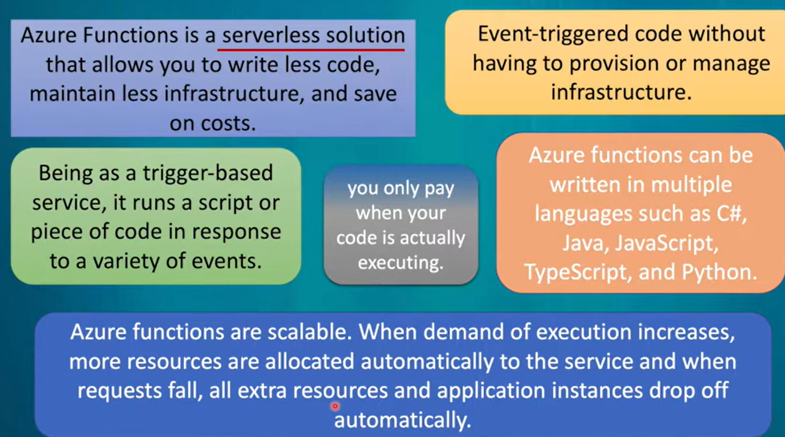
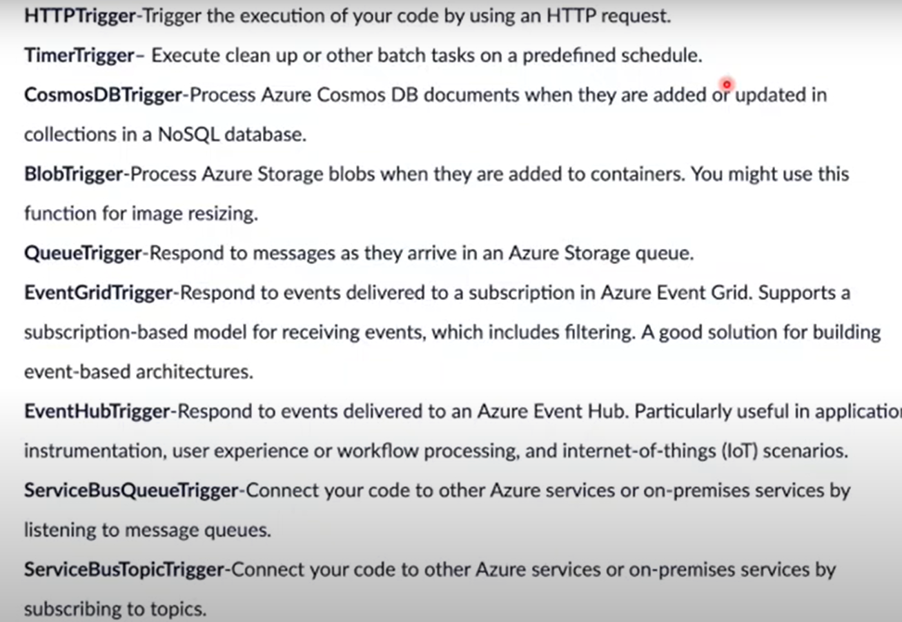

open vs 2022 
- add new project
- choose project type as azure function
- 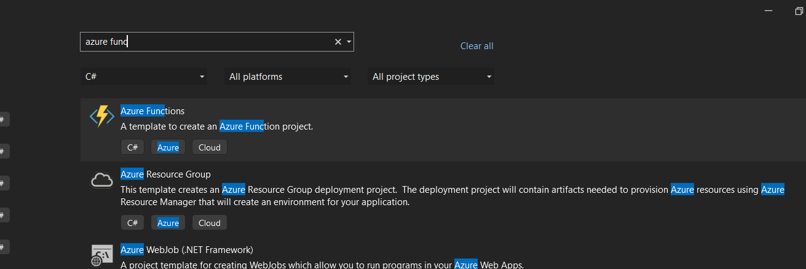
- 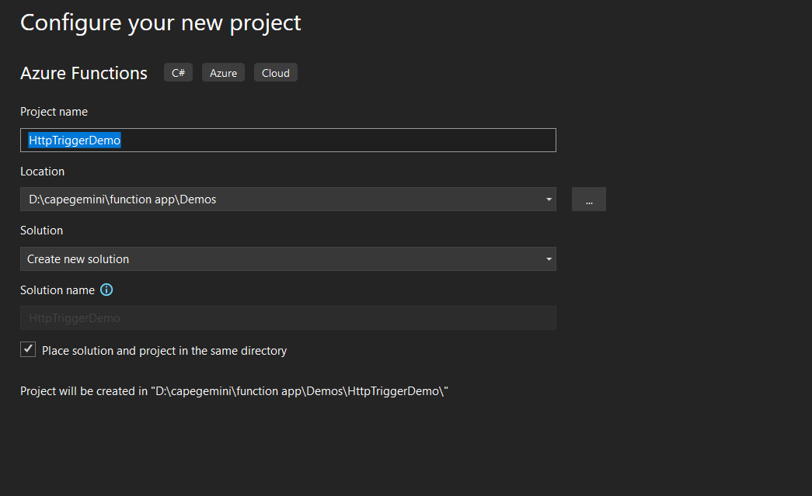
- 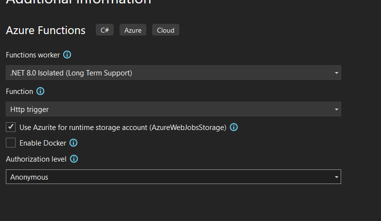
- 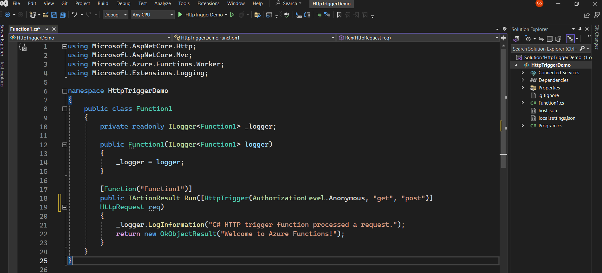
- 

```csharp
 public class Function1
 {
     private readonly ILogger<Function1> _logger;

     public Function1(ILogger<Function1> logger)
     {
         _logger = logger;
     }
     [Function("Function1")]
     public IActionResult Run([HttpTrigger(AuthorizationLevel.Anonymous,
         "get", "post")]
     HttpRequestData req)
     {
         _logger.LogInformation("C# HTTP trigger function processed a request.");
          return new OkObjectResult("Welcome to Azure Functions!");
     }
 }
 ```
run  your app
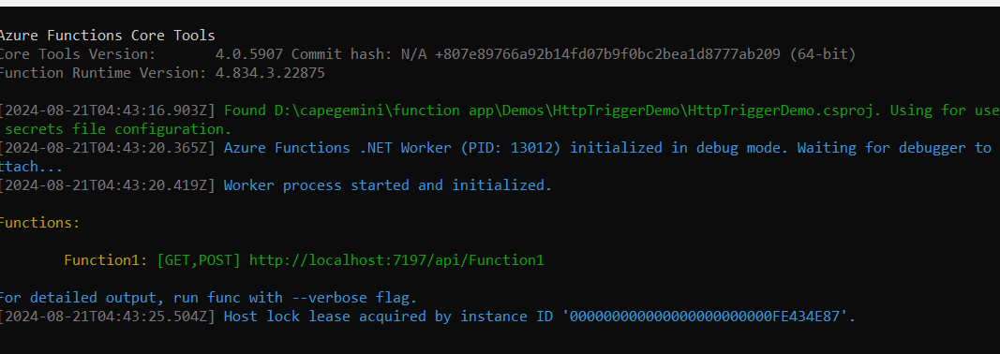
you will find the  url 
http://localhost:7197/api/Function1
paste that url in browser.
Httptrigger enabled 
and it shows the content in the browser.

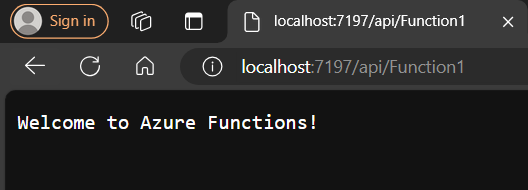


if you wish to return json type of values in http trigger 
add another function below to function1 

```csharp
using Microsoft.Azure.Functions.Worker;
using Microsoft.Azure.Functions.Worker.Http;

        [Function("HttpFunction")]
        public async Task<HttpResponseData> Excecute([HttpTrigger(AuthorizationLevel.Anonymous,
            "get", "post",Route ="walkthrough")]
        HttpRequestData req)
        {
            _logger.LogInformation("C# HTTP trigger function processed a request.");
            var response = req.CreateResponse(HttpStatusCode.OK);
            await response.WriteAsJsonAsync(new
            {
                Name = "Azure Function",
                currentTime = DateTime.Now,
            });
            return response;
        }
        ```

         in the above code we gave route, return type as HttpResponseData

save ==> run 

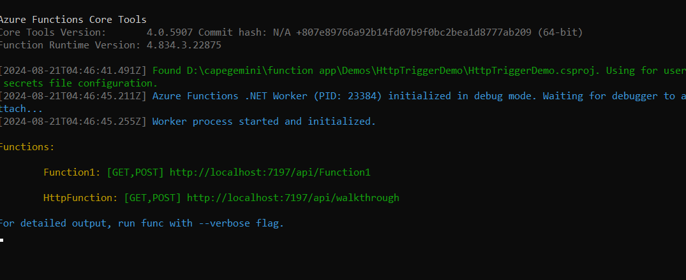

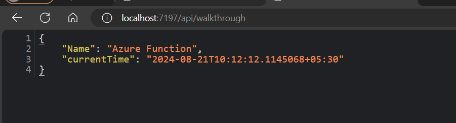

if we write more function in one class that we can deploy together 


# blob trigger 

-goto azure portal 
- create resource group <rg-blogtrigger>
- create storageaccount <blotriggersa>

add container <democontainer>

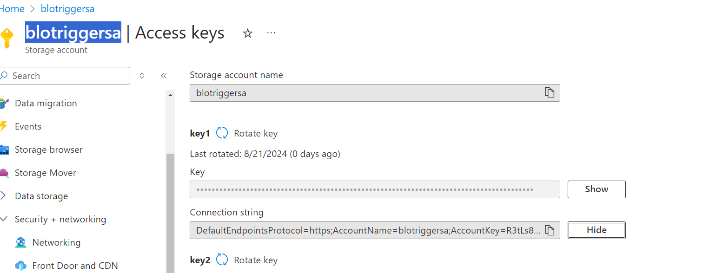
- copy the connection string  ==> 


goto vs2022 
- add new project
- azure function
- blobtrigger
- anonymus access
- paste the copied connectionstring in connectionstring

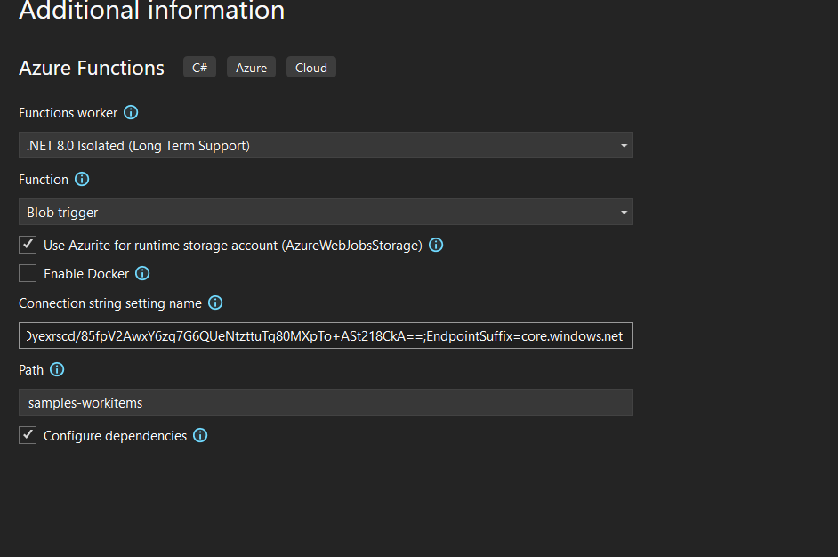
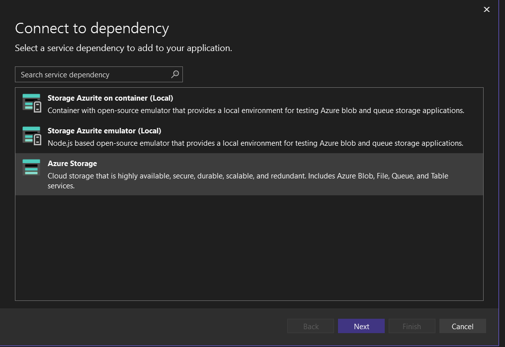
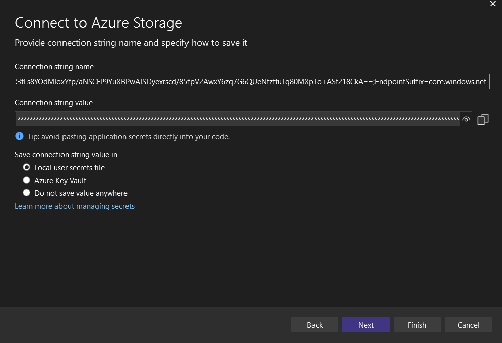
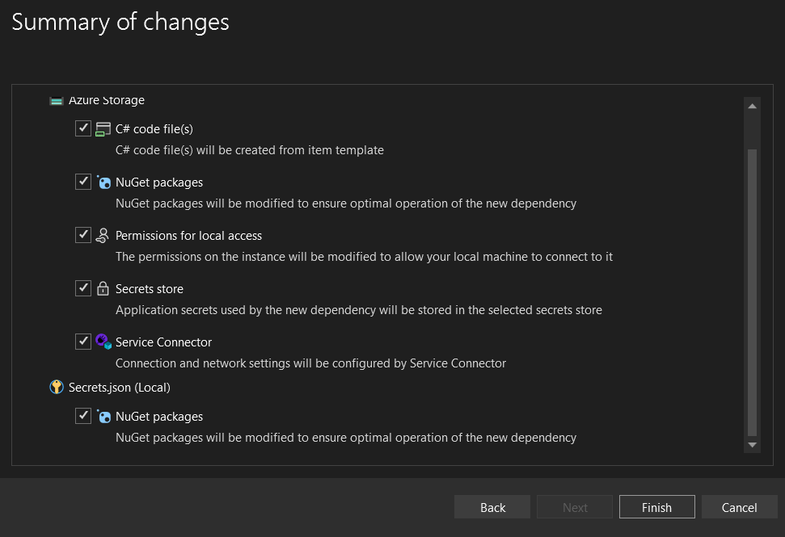
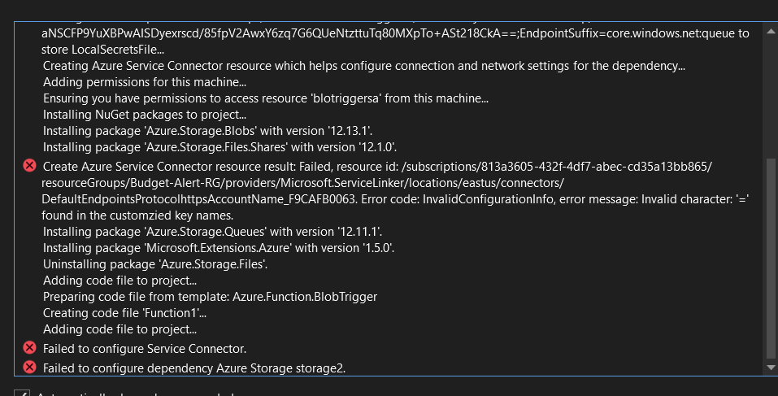

to avoid dependency error change the version csproj file
build 
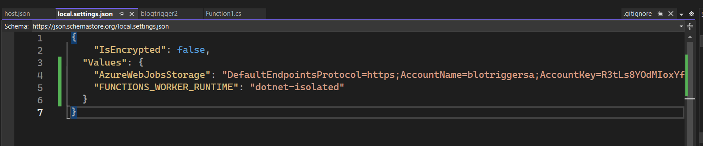
```csharp
using System.IO;
using System.Threading.Tasks;
using Microsoft.Azure.Functions.Worker;
using Microsoft.Extensions.Logging;

namespace blogtrigger2
{
    public class Function1
    {
        private readonly ILogger<Function1> _logger;

        public Function1(ILogger<Function1> logger)
        {
            _logger = logger;
        }

        [Function(nameof(Function1))]
        public async Task Run([BlobTrigger("democontainer/{name}", Connection = "")] Stream stream, string name)
        {
            using var blobStreamReader = new StreamReader(stream);
            var content = await blobStreamReader.ReadToEndAsync();
            _logger.LogInformation($"C# Blob trigger function Processed blob\n Name: {name} \n Data: {content}");
        }
    }
}
```

run your application
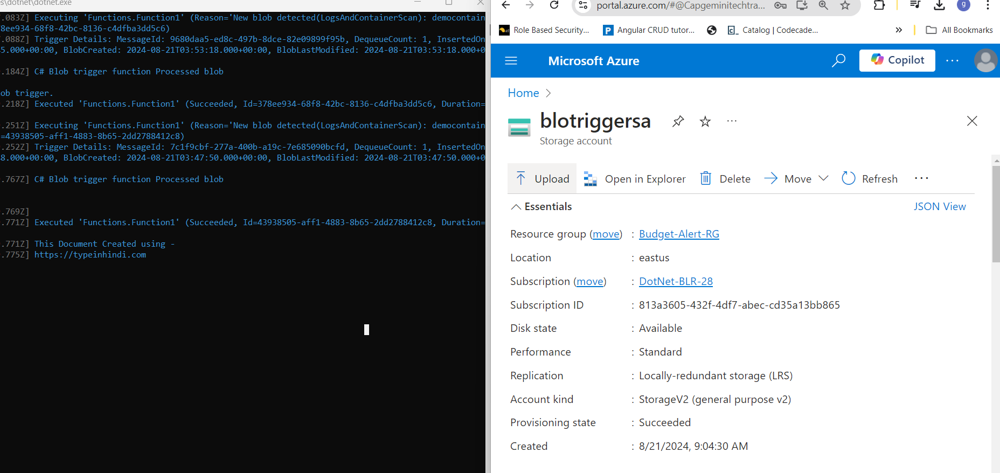
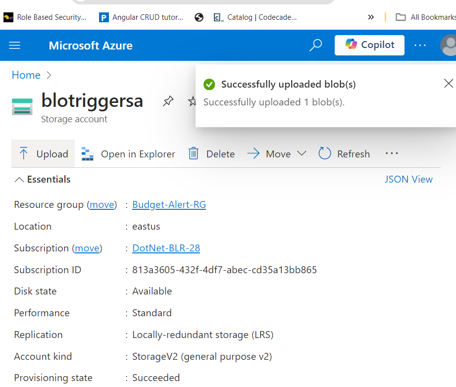

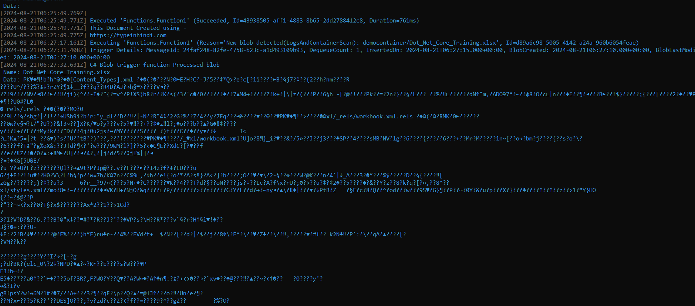